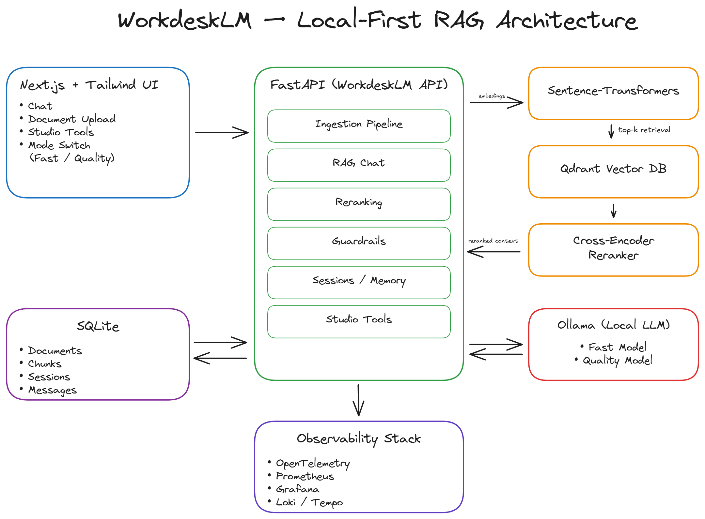

# WorkdeskLM - Local-First NotebookLM-Style RAG System

**with Evaluation, Observability, and Product-Grade Features**

WorkdeskLM is a fully local, production-inspired Retrieval-Augmented Generation (RAG) system designed to replicate and extend the core ideas behind Google's NotebookLM - while running entirely on local hardware.

The project emphasizes **measurable quality** and **hallucination control**. It supports document-grounded chat, strict citations, evaluation benchmarks, observability, reranking, and workflow tools such as briefs and flashcards.

---

## Key Principles

- **Local-first** - no cloud dependencies; all models and data run locally
- **Grounded answers** - strict citations or explicit abstention
- **Measured improvement** - each generation includes evaluation results
- **Product mindset** - sessions, tools, observability, and reliability

---

## My Hardware & Environment

- OS: Windows (Docker Desktop with WSL2)
- RAM: 32 GB
- GPU: NVIDIA RTX 4050 (6 GB VRAM)
- LLM Runtime: Ollama (host)
- All services orchestrated via Docker Compose

---

## Architecture Overview

WorkdeskLM consists of the following core components:

- **Frontend**: Custom Next.js + Tailwind UI
- **API**: FastAPI backend
- **Vector DB**: Qdrant (Docker)
- **Metadata Store**: SQLite
- **Embeddings**: sentence-transformers (local)
- **LLMs**: Ollama (Fast / Quality modes)
- **Observability**: OpenTelemetry, Prometheus, Grafana, Loki, Tempo



The system implements a multi-stage RAG pipeline with reranking, guardrails, session memory, and evaluation hooks.

---

## Model Modes

- **Fast mode**: `phi3:mini`  
  Optimized for responsiveness and low latency.

- **Quality mode**: `qwen2.5:7b-instruct`  
  Optimized for reasoning quality, citation correctness, and abstention accuracy.

Users can switch modes at runtime.

---

## Generation 1 - Cited Document Chat (MVP)

#### Features:
- PDF / TXT / MD ingestion
- Chunking with overlap + metadata
- Local embeddings + Qdrant vector search
- RAG answers with strict citations
- Abstention when evidence is insufficient

#### Deliverables:
- Architecture diagram
- Working local RAG system
- Demo screenshots

---

## Generation 2 - Evaluation & Observability

#### Evaluation:
- Custom benchmark dataset (40 questions, answerable + unanswerable)
- Metrics:
  - Retrieval hit@k
  - Citation correctness
  - Answer correctness
  - Abstention correctness
  - Latency breakdown

#### Observability:
- Distributed traces (OpenTelemetry → Tempo)
- Metrics (Prometheus)
- Logs (Loki)
- Dashboards (Grafana)

#### Example Results (40 questions):

- Fast mode:
  - retrieval_hit@k: 0.60
  - answer correctness: 0.63
  - citation correctness: 0.25
  - abstention correctness: 0.73
  - avg latency: ~2.0 s

- Quality mode:
  - retrieval_hit@k: 0.60
  - answer correctness: 0.88
  - citation correctness: 0.48
  - abstention correctness: 1.00
  - avg latency: ~2.3 s

Insight: Retrieval - not generation - was the main quality bottleneck.

---

## Generation 3 - Product-Grade Features

### Improvements:
- **Two-stage retrieval with reranking** (cross-encoder)
- **Session memory** with optional summaries
- **Studio tools**: Document briefs and Flashcard generation
- Hardened JSON parsing and failure handling

#### Expected impact:
- Improved retrieval hit@k
- Higher citation correctness
- Stronger reliability under real usage

---

## Why This Project Matters

WorkdeskLM demonstrates:
- Local deployment of modern RAG systems
- Engineering trade-offs between latency and quality
- Evaluation-driven iteration
- Production-style observability and debugging
- Responsible AI behavior via abstention

This project was built to resemble real-world AI systems rather than demos, and serves as a foundation for further research.

---

## Running the Project

1. Start all services:
   ```bash
   docker compose up -d --build
   ```
2. API:  
   http://localhost:8000/docs

3. Frontend:  
   http://localhost:3000

4. Grafana:  
   http://localhost:3001